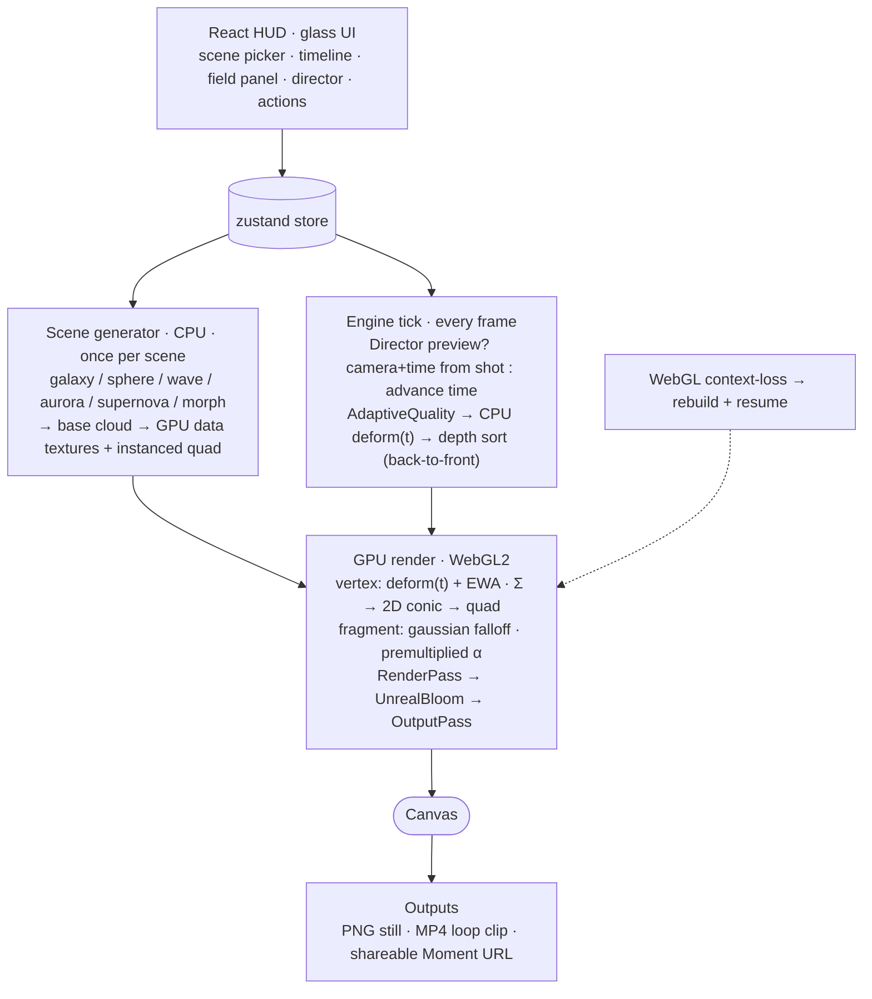
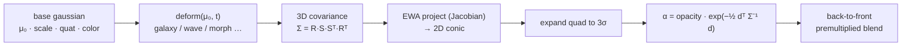

# CHRONO — Architecture & Pipeline

A live, styled version renders at **`/pipeline.html`** when the dev server is running
(`npm run dev` → http://localhost:5173/pipeline.html). The Mermaid diagrams below
render directly on GitHub / in VS Code's preview.

## What it can do

- **Render 4D gaussian splats in real time** — true EWA splatting (covariance → screen-space
  conic → exp falloff), depth-sorted back-to-front, premultiplied-alpha, with bloom.
- **Freeze-and-orbit** — grab the scene to stop time, orbit the frozen instant from any angle.
- **6 procedural scenes** — Galaxy, Pulse, Supernova, Wave, Aurora, Morph (sphere↔torus↔cube).
- **Live field params** — density, motion amplitude, bloom, 4 palettes.
- **Timeline transport** — play / pause / scrub / speed, seamless looping.
- **Director Mode** — dual-track **camera × scene-time** keyframes: author a moving shot through
  a moving (or frozen) world.
- **Capture & share** — PNG still, MP4 loop clip, and a deep-link **Moment** that reopens the
  exact orbitable instant.
- **Adaptive quality** — holds target FPS (Auto + Low/Med/High/Ultra), 300k gaussian ceiling.
- **Resilient** — recovers from WebGL context loss; clamps/validates all external input.

## End-to-end pipeline



## Per-gaussian splat math (the core)



## Source map

| Stage | Files |
| --- | --- |
| UI (HUD) | `src/ui/*` (Hud, Timeline, SceneToggle, SettingsPanel, DirectorTrack, ActionBar, FreezeBadge) |
| State bridge | `src/state/store.ts` (zustand) |
| Scene generation | `src/engine/scenes/{generators,registry}.ts` |
| Time deformation | `src/engine/scenes/deform.ts` (CPU mirror) + `src/engine/gaussian/shaders/splat.vert.glsl` (GPU) |
| Splat render | `src/engine/gaussian/GaussianCloud.ts` + `shaders/splat.{vert,frag}.glsl` |
| Depth sort | `src/engine/sort/sortGaussians.ts` |
| Engine loop | `src/engine/SplatViewer.ts` |
| Perf | `src/engine/perf/AdaptiveQuality.ts` |
| Director | `src/director/{types,shot,interpolate}.ts` |
| Capture / share | `src/capture/CaptureController.ts`, `src/share/{deeplink,moments}.ts` |
| Backdrop | `src/engine/Backdrop.ts` |
```
